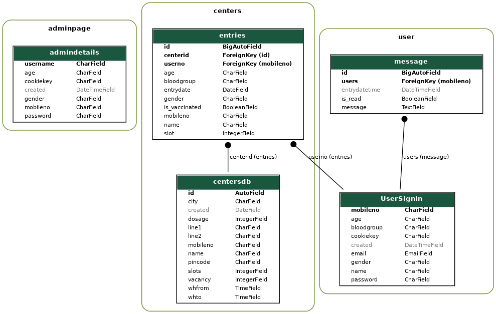

## BookMyVaX


A web application for covid vaccination booking


## Badges


## Installation


For Environmental installation of packages
```bash
  pip3 install pipenv
```

To environmentally install pip environment 

```bash
  pipenv install django
```

## Folder Structure

<details open>
    <summary>devrev: master file which contains all the settings</summary>
    <ul>
        <li> _pycache_: cache files</li>
        <li>migrations: db cache and migraions</li>
        <li>_init_.py: normal init py file</li>
        <li>asgi.py: It exposes the ASGI callable as a module-level variable named ``application``</li>
        <li>settings.py: Django settings for devrev project. Generated by 'django-admin startproject' using Django 4.2.1.</li>
        <li>urls.py: URL configuration for devrev project.</li>
        <li>wsgi.py: It exposes the WSGI callable as a module-level variable named ``application``</li>
    </ul>
</details>
<details open>
    <summary>templates: frontend folders</summary>
    <ul>
        <li>admin: contains simple UI of admin</li>
        <li>user: contains simple UI of user</li>
    </ul>
</details>

<details open>
    <summary>user folder: backend of user</summary>
    <ul>
        <li> _pycache_: cache files</li>
        <li>migrations: db cache and migraions</li>
        <li>_init_.py: normal init py file</li>
        <li>admin.py: enable admin control of db</li>
        <li>apps.py: app configuration</li>
        <li>models.py: for db managing, creating, etc</li>
        <li>urls.py: for defining the urls for each backend folder</li>
        <li>views.py: contains backend for each apps</li>
        <li>test.py: for testing the server</li>
    </ul>
</details>

<details open>
    <summary>admin folder: backend of admin</summary>
    <ul>
        <li> _pycache_: cache files</li>
        <li>migrations: db cache and migraions</li>
        <li>_init_.py: normal init py file</li>
        <li>admin.py: enable admin control of db</li>
        <li>apps.py: app configuration</li>
        <li>models.py: for db managing, creating, etc</li>
        <li>urls.py: for defining the urls for each backend folder</li>
        <li>views.py: contains backend for each apps</li>
        <li>test.py: for testing the server</li>
    </ul>
</details>

<details open>
    <summary>centers folder: backend for centers(db of centers & some computing functions)</summary>
    <ul>
        <li> _pycache_: cache files</li>
        <li>migrations: db cache and migraions</li>
        <li>_init_.py: normal init py file</li>
        <li>admin.py: enable admin control of db</li>
        <li>apps.py: app configuration</li>
        <li>models.py: for db managing, creating, etc</li>
        <li>urls.py: for defining the urls for each backend folder</li>
        <li>views.py: contains backend for each apps</li>
        <li>test.py: for testing the server</li>
    </ul>
</details>
    - dbsqlite: SQL Database

## Run Locally
Clone the project

```bash
  git clone https://github.com/phandavinci/DevRev
```

Go to the project directory

```bash
  cd your/path/to/project/DevRev
```

Start the server in terminal or commandline

```bash
  python manage.py runserver
```

Link for homepage:http://127.0.0.1:8000/usersignin

## Testing Accounts

### - For user

- Mobileno: 9555595555
- Password: test

### - For Admin

- Username: admin 
- Password: admin

## Acknowledgements

 - Django
 - Python v3.10
 - SQLite3

  
## Database Structure



